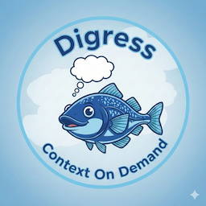

# Digress



**Context On Demand** - Fork Claude Code sessions like git branches.

Explore tangents without polluting your main conversation's context. The forked session gets full history while the parent stays clean.

```
main-idea (context unchanged)
├── branch-1 (full context at fork point)
│   ├── b-1.1 (fork recursively)
│   └── b-1.2
└── branch-2
    └── b-2.1

← circle back to parent anytime
```

## Installation

```bash
git clone <this-repo> ~/projects/digress
cd ~/projects/digress
./install.sh
```

This installs:
1. `/usr/local/bin/digress` - CLI tool
2. `~/.digress/` - State directory
3. `~/.digress-functions.sh` - Shell functions (optional)
4. `~/.claude/CLAUDE.md` - Instructions that teach Claude about digress

**Requirements:**
- macOS with iTerm2
- Claude Code CLI
- `jq` (optional, for tree visualization): `brew install jq`

## Usage

### From Within Claude Code

Just say naturally:
- "digress to auth-exploration"
- "fork this as caching-ideas"
- "branch off to performance-testing"

Claude reads the instructions from `~/.claude/CLAUDE.md` and knows to run the fork command.

**Resuming** needs to be run from your terminal: `digress --resume experiment`

(Resuming spawns a new interactive Claude session, which can't run from inside an existing one.)

**Optional: Auto-approve fork commands.** To skip permission prompts when forking, add to `~/.claude/settings.json`:

```json
{
  "permissions": {
    "allow": [
      "Bash(digress*)"
    ]
  }
}
```

### From Terminal

```bash
digress                      # Fork with default label "tangent"
digress shopping             # Fork with custom label
digress auth --dir ~/myproj  # Fork specific project's session
digress --tree               # View session tree
digress --list               # List known project directories
digress --help               # Show help
```

### Returning to Parent

```bash
digress --resume experiment  # Resume by label
claude --resume              # Interactive session picker
claude --resume "main-idea"  # Resume by session name
```

### Naming Sessions

Name your sessions for easier navigation:
```
/rename main-idea            # From within Claude Code
```

## How It Works

### The Key: `--fork-session`

Claude Code has native support for forking via:

```bash
claude --continue --fork-session
```

This:
- Creates a **new session ID** (changes don't affect parent)
- Preserves **full conversation history** up to the fork point
- Lets both sessions diverge independently

### Critical: Directory Matters

Sessions are directory-specific. The fork must run from the same directory as the parent:

```bash
cd /path/to/project && claude --continue --fork-session
```

The `digress` script handles this automatically.

### How Claude Learns About Digress

Claude doesn't know about `digress` by default. The installer adds instructions to `~/.claude/CLAUDE.md`, which Claude reads at the start of every session. This teaches Claude to:

1. Recognize "digress", "fork", "branch off" as fork requests
2. Run the osascript to open new iTerm window
3. Execute `claude --continue --fork-session` in the correct directory

## Example Workflow

```
1. Start session
   $ cd ~/projects/myapp
   $ claude

2. Work on main idea...

3. Want to explore tangent
   You: "digress to caching-idea"
   → New iTerm window opens with full context

4. Explore in fork...
   (parent window unchanged)

5. Fork again from the fork
   You: "digress to redis-vs-memcached"
   → Another window, another branch

6. Circle back
   $ claude --resume
   → Pick "main-idea" from list

7. Continue where you left off
   (context clean, tangents contained)
```

## Tree Visualization

```bash
$ digress --tree
🌳 Digress Session Tree

  main-idea [~/projects/myapp] (root)
  caching-idea [~/projects/myapp] (parent: main-idea)
  redis-vs-memcached [~/projects/myapp] (parent: caching-idea)
```

## Files

| Location | Purpose |
|----------|---------|
| `/usr/local/bin/digress` | Main CLI script |
| `~/.digress/tree.json` | Tracks fork tree structure |
| `~/.digress/.last_directory` | Last active project directory |
| `~/.digress-functions.sh` | Shell functions (fork, back) |
| `~/.claude/CLAUDE.md` | Claude's instructions |

## Shell Functions (Optional)

Add to `~/.zshrc` for extra convenience:

```bash
source ~/.digress-functions.sh
```

Provides:
- `fork [label]` - Quick fork from terminal
- `fork_from <parent> [label]` - Fork from specific session
- `back <session>` - Resume a session
- `digress-tree` - Alias for `digress --tree`

## Manual Setup (Without Installer)

If you prefer manual setup:

1. Copy `digress` to your PATH (e.g., `/usr/local/bin/digress`)
2. Make it executable: `chmod +x /usr/local/bin/digress`
3. Add this to `~/.claude/CLAUDE.md`:

```markdown
## DIGRESS COMMAND

When the user says "digress", "digress to X", "fork", or "branch off to X",
they want to fork the current Claude session into a new terminal window.

Run this bash command:

digress LABEL --dir DIRECTORY

Replace LABEL with requested name and DIRECTORY with current working directory.
```

## Why Not Pipe History to CLI?

Initial idea was to manage conversation as a text file and pipe it to Claude. This doesn't work because:

1. Claude Code isn't stateless - it has tools, permissions, state
2. Would lose all tool capabilities
3. Inefficient (resending entire history each message)

Using `--fork-session` leverages Claude Code's native session management.

## Limitations

- **macOS + iTerm2 only** - uses AppleScript
- **No real `/digress` slash command** - Claude interprets natural language
- **Tree tracking is local** - only knows forks made via digress

## Future Ideas

- Terminal.app support
- Linux support (gnome-terminal, etc.)
- True slash command via Claude Code hooks/skills
- Cross-machine sync

## About the Name

**Digress** means to wander from the main topic - exactly what you do when exploring a tangent.

The cod fish mascot? **COD** = **C**ontext **O**n **D**emand.
